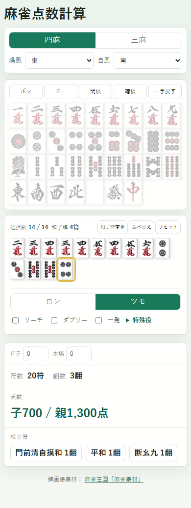

# 麻雀点数計算

ブラウザ上で動作する麻雀点数計算アプリです。ビルドやAPIキーは不要で、`index.html` を開くだけで利用できます。

## 使用素材・ライブラリ

- 牌画像素材：[麻雀王国「麻雀素材」](https://mj-king.net/sozai/)
- 点数計算：[@kobalab/majiang-core](https://github.com/kobalab/majiang-core)（MIT）
